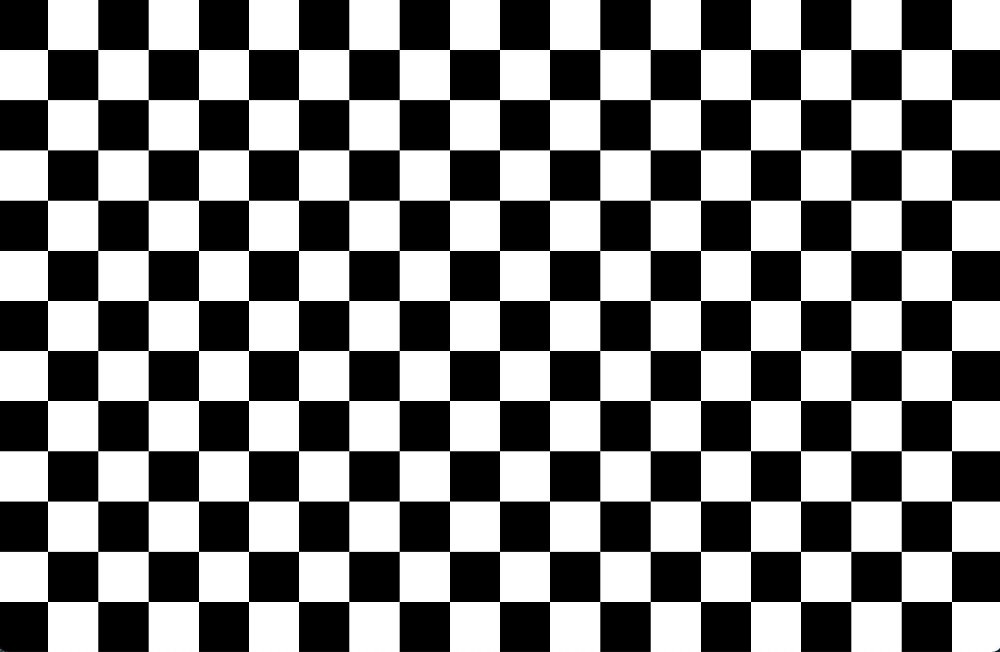
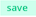

# visualstim


---

- [visualstim](#visualstim)
  - [Getting started](#getting-started)
  - [Basic usage](#basic-usage)
    - [Control window vs display window](#control-window-vs-display-window)
    - [Modes](#modes)
    - [Stimulus type](#stimulus-type)
    - [Stimulus parameters](#stimulus-parameters)
    - [Sync parameters](#sync-parameters)
    - [Saving parameters](#saving-parameters)
    - [Scripting mode and experiment files](#scripting-mode-and-experiment-files)

---


## Getting started

1. clone this repo: `git clone https://github.com/maxtaylordavies/visualstim.git` and `cd visualstim`
2. create conda environment: `conda env create -f environment.yml`
   - if this fails, you can create the environment and add the required packages manually with `conda create -n visualstim python=3.6` and `conda activate visualstim` followed by `conda install -c conda-forge pywinhook` and then `conda install -c conda-forge psychopy`
   - you can verify the package installations with `conda list` - you should see (amongst other things) `psychopy 2021.2.3`
3. run `python test.py` to see the GUI

## Basic usage

### Control window vs display window

After creating an instance of the `Interface` class and calling its `.start()` method, you should be greeted with a window that looks like this:


This is the **visualstim control window**. It contains elements for interactively controlling the visual stimulation. By default, the **visualstim display window** is the same as the control window; i.e. when you click , the GUI elements of the control window disappear and are replaced by the stimulus, and return after the stimulus is complete. If you have more than one display available (e.g. you're running visualstim on a laptop connected to an external monitor), you can click  to spin out a separate display window. This lets you show the control window on one screen while displaying the stimulus on another screen.

### Modes

The visualstim software has two different usage modes: **interactive** and **scripting**. In interactive mode (enabled by default), you can use the GUI panels to play around with the parameters and display a **single stimulus type**. **Scripting mode** lets you load and display a multi-stimulus sequence defined in an external file. For details on how to write such files, jump to [Scripting mode and experiment files](#scripting-mode-and-experiment-files).

### Stimulus type

The **stimulus type** panel lets you choose the stimulus you want to display. Currently, the options are
- **gratings**
  - _static grating_: a sinusoidal grating that does not move (i.e. is static)
  - _drift grating_: a sinusoidal grating that moves across the display window in one direction
  - _osc grating_: a sinusoidal grating that oscillates back and forth across the display window 
- **sparse noise**: a noise movie showing black and white blocks placed randomly against a grey background 
- **checkerboard**: a black and white checkerboard that flips colors back and forth 
- **movie**: an arbitrary video loaded either from a local file or a url. Local files should be placed in the `movies/` folder. Works for any format supported by [AVbin](https://avbin.github.io/docs/) (e.g. `.mp4`, `.avi`, `.mov` etc)

More stimulus types will be added in future updates.

### Stimulus parameters

The **stimulus parameters** panel lets you adjust the parameters of the visual stimulation. The set of parameters available to control depends on which stimulus type is currently selected - e.g. for **drift grating** we need to know the `temp freq`, for **movie** we need to know the `filename` etc. Some parameters, such as `stim duration`, can take only a single scalar value, e.g. `10.0`. Other parameters, such as `orientation` or `spat freq` can be given multiple values to cycle through during stimulation. For one of these parameters, clicking on their input will open an expanded box that looks like this:


You can then select appropriate start and stop values, as well as number of steps. For example, setting `start: 0.0`, `stop: 60.0` and `steps: 4` will give you the array of orientation values `[0.0, 15.0, 30.0, 45.0, 60.0]`. Selecting `random` shuffles the order of the array.

If you set multiple values for more than one parameter, then the stimulation will include all combinations of the multi-valued parameters. E.g. if you set 4 values for `orientation` and 2 values for `spat freq`, you will see 8 different variations of the selected stimulus.

### Sync parameters

The **sync parameters** panel contains controls for synchronisation/triggering. If you don't need to synchronise your visual stimulation with any external system (e.g. 2P imaging, behavioural recording etc) then you can safely ignore this panel.

**Sync mode** is disabled by default. If you enable it by toggling  to , you should see two small black squares appear in the bottom left corner of the **display window**. These are the **trigger square** and **sync square**, and are intended to provide an interface to external systems via the use of photodiodes attached to the stimulus display monitor.

In **sync mode**, clicking  will not begin playing the visual stimulus immediately, but will instead activate a **trigger period**

- The purpose of the trigger period is to allow time for external systems (such as a 2P microscope) to activate, so that they start performing their function at the same time as the stimulus onset
- The length of the trigger period can be set within the sync panel
- At the start of the trigger period, the trigger square flashes white for `p` frames (where `p` is the value supplied for `pulse length`), producing a voltage pulse in the photodiode covering the trigger square
- This photodiode should be connected to the appropriate input(s) of whatever external system(s) you want to trigger

After the user-defined trigger duration has elapsed, the selected stimulus will begin playing as normal. In **sync mode**, while the stimulus is playing, the **sync square** will flash white every `n` frames (where `n` is the value supplied for `sync interval`). This allows the user to send a regular synchronisation pulse to an external clock system, in order to align the stimulus frame timestamps with data from any other systems (e.g. 2P imaging data).

### Saving parameters

If you want to recreate/reuse a particular selection of parameters in interactive mode at a later point, you can click the  button in the top bar. This will export your selection to an **experiment file** (named according to the current date and time) in the top-level `experiments/` folder. You can then select and play this file when in **scripting mode** in order to recreate your selection.

### Scripting mode and experiment files

When running the visualstim software, you start in interactive mode by default. You can switch modes by clicking , at which point you should see a screen that looks something like this:


The panel labeled "load experiment" shows a list of all the files contained in the top-level `experiments/` folder. To load an experiment, just click on the name of its file. You can then run the experiment by clicking .

An experiment consists basically of two things: a set of _sync settings_, and sequence of _stimuli_ (where each stimulus has an associated set of parameters). Experiment files are written using [the JSON data format](https://developer.mozilla.org/en-US/docs/Learn/JavaScript/Objects/JSON). Here's a basic example of an experiment file with only one stimulus and no sync:

```JSON
{
    "sync settings": {
        "sync": false
    },
    "stimuli": [
        {
            "name": "drift grating",
            "params": {
                "spat freq": 0.1,
                "temp freq": 0.4,
                "orientation": 0.0,
                "stim duration": 10.0
            }
        }
    ]
}
```

Here's an example with sync and multiple stimuli:

```JSON
{
    "sync settings": {
        "sync": true,
        "trigger duration": 5.0,
        "sync interval": 60,
        "pulse length": 3
    },
    "stimuli": [
        {
            "name": "drift grating",
            "params": {
                "spat freq": 0.1,
                "temp freq": 0.4,
                "orientation": 0.0,
                "stim duration": 5.0
            }
        },
        {
            "name": "static grating",
            "params": {
                "spat freq": 0.2,
                "orientation": 45.0,
                "stim duration": 5.0
            }
        },
        {
            "name": "movie",
            "params": {
                "stim duration": 10.0,
                "filename": "test.mp4",
                "fit screen": false
            }
        }
    ]
}
```

Any experiment files you write should be saved to the top-level `experiments/` folder.
