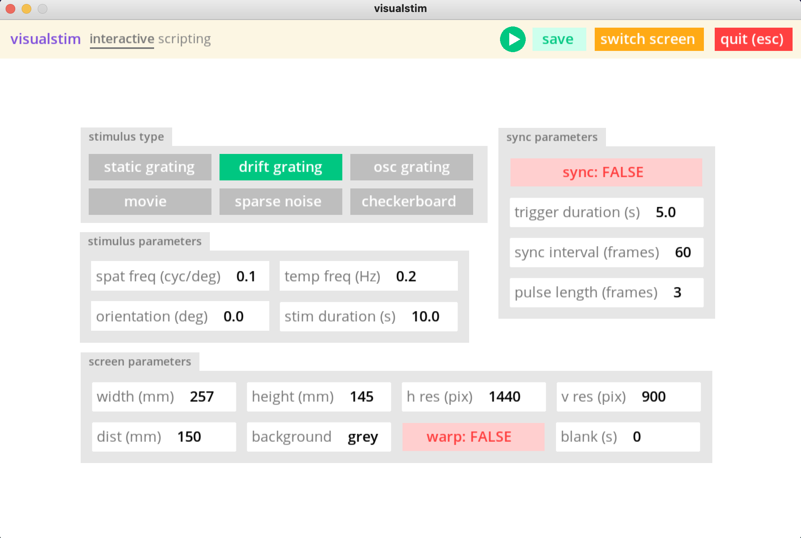

# visualstim

## Getting started

1. clone this repo: `git clone https://github.com/maxtaylordavies/visualstim.git` and `cd visualstim`
2. create conda environment: `conda env create -f environment.yml`
   - if this fails, you can add the required packages manually with `conda install -c conda-forge pywinhook` and then `conda install -c conda-forge psychopy`
   - you can verify the package installations with `conda list` - you should see (amongst other things) `psychopy 2021.2.3`
3. run `python test.py` to see the GUI

## Basic usage

### Control window vs display window

After creating an instance of the `Interface` class and calling its `.start()` method, you should be greeted with a window that looks like this:

This is the **visualstim control window**. It contains elements for interactively controlling the visual stimulation. By default, the **visualstim display window** is the same as the control window; i.e. when you click , the GUI elements of the control window disappear and are replaced by the stimulus, and return after the stimulus is complete. If you have more than one display available (e.g. you're running visualstim on a laptop connected to an external monitor), you can click  to spin out a separate display window. This lets you show the control window on one screen while displaying the stimulus on another screen.
